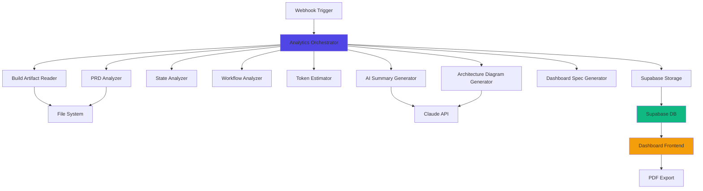

# JAWS Analytics - Technical Documentation

## Architecture Overview

The JAWS Analytics system follows a microservices-style architecture using n8n workflows as independent processing units orchestrated by a main coordinator.

### System Diagram



## Data Flow

### Input Processing

```
Build Path → Validation → File Reading → Parsing → Analysis
     ↓
/path/to/project/
     ├── PRD.md (required)
     ├── progress.txt (required)
     ├── ralph-state.json (required)
     ├── AGENTS.md (optional)
     └── workflows/ (optional)
          └── *.json (n8n workflows)
```

### Analysis Pipeline

```
Raw Files → Structured Extraction → AI Enhancement → Compilation → Storage
    ↓              ↓                      ↓               ↓            ↓
PRD.md     Project name           Executive     Dashboard    jaws_builds
progress   Client name            summary       spec.json    jaws_workflows
state      Task counts            Technical                  jaws_tables
workflows  Iteration metrics      summary
           Token estimates        Architecture
           Node breakdowns        diagram
```

### Output Generation

```
Database Records → Dashboard Query → React Components → Visualization
                                                       → PDF Export
                                                       → Client Deliverable
```

## Workflow Breakdown

### 1. Analytics Orchestrator (`analytics-orchestrator.json`)

**Purpose**: Main coordinator that calls all sub-workflows in sequence

**Trigger**: Webhook at `/webhook/analyze-build`

**Input**:
```json
{
  "build_path": "/path/to/project",
  "project_name": "My Project",
  "client_name": "Client Name (optional)"
}
```

**Node Count**: 27 nodes

**Flow**:
1. Webhook Trigger (receives HTTP POST)
2. Validate Input (check required fields)
3. Check Valid (If node → error or continue)
4. For each sub-workflow (pattern: Prepare → Call → Process):
   - Prepare input data
   - Call sub-workflow (continueOnFail: true)
   - Process result (handle errors gracefully)
5. Build Final Response
6. Success Response (200 or 207)

**Error Handling**:
- Each sub-workflow call has `continueOnFail: true`
- Errors accumulate in array
- Final status: 200 (all success) or 207 (partial success)
- Returns detailed error information per failed step

**Output**:
```json
{
  "status": 200,
  "result": "success",
  "summary": {
    "steps_total": 9,
    "steps_succeeded": 9,
    "steps_failed": 0,
    "warnings": 0
  },
  "data": {
    "prd_analysis": {...},
    "state_analysis": {...},
    "workflow_analysis": {...},
    "dashboard_spec": {...}
  },
  "errors": [],
  "warnings": []
}
```

### 2. Build Artifact Reader (`build-artifact-reader.json`)

**Purpose**: Read and parse all files from project directory

**Trigger**: Execute Workflow Trigger (called by orchestrator)

**Node Count**: 12 nodes

**Flow**:
1. Execute Workflow Trigger
2. Validate Input (check build_path exists)
3. Normalize Path (handle Windows/Unix differences)
4. Read PRD.md → Parse markdown
5. Read progress.txt → Parse text
6. Read ralph-state.json → Parse JSON
7. Read AGENTS.md (optional) → Parse markdown
8. Find workflows → Read all *.json files
9. Check Complete (verify required files read)
10. Build Response

**File Handling**:
- Required files: PRD.md, progress.txt, ralph-state.json
- Optional files: AGENTS.md, workflows/*.json
- Missing required → 400 error with details
- Missing optional → Continue with null

**Output**:
```json
{
  "status": 200,
  "build_path": "/path/to/project",
  "files": {
    "prd_content": "# PRD...",
    "progress_content": "...",
    "state_content": {...},
    "agents_content": "...",
    "workflows": [...]
  },
  "files_read": 5,
  "missing_files": []
}
```

### 3. PRD Analyzer (`prd-analyzer.json`)

**Purpose**: Extract structured metrics from PRD.md

**Trigger**: Execute Workflow Trigger

**Node Count**: 10 nodes

**Flow**:
1. Execute Workflow Trigger
2. Validate Input (check prd_content exists)
3. Extract Project Name (regex: `# PRD: (.+)`)
4. Extract Client Name (regex: `\*\*Client:\*\* (.+)`)
5. Count User Stories (regex: `### US-\d+`)
6. Count Tasks (completed `[x]`, incomplete `[ ]`, skipped `[SKIPPED]`)
7. Extract Phases (regex: `PHASE \d+: (.+?) \[CHECKPOINT: (.+?)\]`)
8. Extract Goals (list items under `## Goals`)
9. Extract Tech Stack (list items under `## Technical Stack`)
10. Build Response

**Regex Patterns**:
```javascript
// Project name
/# PRD: (.+)/

// Client name
/\*\*Client:\*\* (.+)/

// User stories
/### US-\d+/g

// Completed tasks
/- \[x\]/gi

// Phases
/PHASE\s+(\d+):\s+(.+?)\s+\[CHECKPOINT:\s+(.+?)\]/g

// Goals/Tech Stack
/^- (.+)$/gm (under specific section)
```

**Edge Cases Handled**:
- Nested lists (only count top-level items)
- Code blocks (skip markdown in code blocks)
- Variable whitespace
- Missing optional fields

**Output**:
```json
{
  "status": 200,
  "data": {
    "project_name": "JAWS Analytics Dashboard System",
    "client_name": "Internal",
    "total_user_stories": 23,
    "tasks_total": 150,
    "tasks_completed": 145,
    "tasks_incomplete": 2,
    "tasks_skipped": 3,
    "completion_rate": 96.67,
    "phases": [
      {
        "phase": 1,
        "name": "Foundation",
        "checkpoint": "FOUNDATION"
      }
    ],
    "goals": [...],
    "tech_stack": [...]
  }
}
```

### 4. State Analyzer (`state-analyzer.json`)

**Purpose**: Extract build metrics from ralph-state.json

**Trigger**: Execute Workflow Trigger

**Node Count**: 8 nodes

**Flow**:
1. Execute Workflow Trigger
2. Validate Input (check state_content exists)
3. Extract Iteration Metrics (currentIteration, maxIterations)
4. Extract Task Arrays (completedTasks, failedTasks, skippedTasks)
5. Extract Build Quality (consecutiveFailures, checkpointHistory, rabbitHoles)
6. Extract Learnings (from learnings array)
7. Calculate Build Duration (from timestamps)
8. Build Response

**Calculated Metrics**:
- Build duration (start → end timestamps)
- Checkpoint trigger count
- Rabbit hole detection count
- Average iterations per task
- Failure recovery rate

**Output**:
```json
{
  "status": 200,
  "data": {
    "iterations_used": 42,
    "iterations_max": 50,
    "completed_tasks": ["US-001", "US-002", ...],
    "failed_tasks": [],
    "skipped_tasks": ["US-004"],
    "consecutive_failures": 0,
    "checkpoints_triggered": 4,
    "rabbit_holes_detected": 2,
    "learnings_count": 15,
    "build_duration_minutes": 245,
    "checkpoint_history": [...]
  }
}
```

### 5. Workflow Analyzer (`workflow-analyzer.json`)

**Purpose**: Analyze n8n workflow JSON files for node counts and relationships

**Trigger**: Execute Workflow Trigger

**Node Count**: 9 nodes

**Flow**:
1. Execute Workflow Trigger
2. Validate Input (check workflows array)
3. For Each Workflow:
   - Extract workflow name
   - Count total nodes
   - Identify trigger type
   - Count node types (HTTP, Code, If, Merge, etc.)
   - Count Claude API nodes (anthropic.com URLs)
   - Count Supabase nodes (supabase.co URLs)
   - Extract workflow relationships (Execute Workflow nodes)
   - Calculate estimated tokens
4. Build Response

**Node Type Detection**:
```javascript
// Claude API nodes
node.type === 'n8n-nodes-base.httpRequest' &&
  node.parameters.url.includes('anthropic.com')

// Supabase nodes
node.type === 'n8n-nodes-base.httpRequest' &&
  node.parameters.url.includes('supabase.co')

// Trigger types
'n8n-nodes-base.webhook' → 'webhook'
'n8n-nodes-base.executeWorkflowTrigger' → 'execute'
'n8n-nodes-base.scheduleTrigger' → 'schedule'
```

**Workflow Relationships**:
- Maps Execute Workflow nodes to called workflow names
- Builds dependency tree
- Identifies orchestrator vs. sub-workflows

**Output**:
```json
{
  "status": 200,
  "data": [
    {
      "workflow_name": "Analytics Orchestrator",
      "workflow_type": "orchestrator",
      "trigger_type": "webhook",
      "node_count": 27,
      "claude_nodes": 0,
      "supabase_nodes": 0,
      "estimated_tokens": 0,
      "purpose": "Coordinates all sub-workflows",
      "nodes_breakdown": {
        "webhook": 1,
        "code": 10,
        "executeWorkflow": 9,
        "if": 3,
        "merge": 2
      },
      "calls_workflows": [
        "Build Artifact Reader",
        "PRD Analyzer",
        ...
      ]
    }
  ]
}
```

### 6. Token Estimator (`token-estimator.json`)

**Purpose**: Estimate Claude API token usage and costs

**Trigger**: Execute Workflow Trigger

**Node Count**: 7 nodes

**Flow**:
1. Execute Workflow Trigger
2. Validate Input (check claude_nodes array)
3. For Each Claude Node:
   - Extract system prompt → estimate tokens (~4 chars = 1 token)
   - Extract user prompt template → estimate tokens
   - Add dynamic content estimate (default: 200 tokens)
   - Extract max_tokens for response
   - Calculate input cost ($3/M tokens)
   - Calculate output cost ($15/M tokens)
4. Sum totals across all nodes
5. Calculate monthly projections (assumes frequency)
6. Build Response

**Token Estimation Formula**:
```javascript
// Input tokens
const systemTokens = Math.ceil(systemPrompt.length / 4)
const userTokens = Math.ceil(userTemplate.length / 4)
const dynamicTokens = 200 // configurable
const inputTokens = systemTokens + userTokens + dynamicTokens

// Output tokens
const outputTokens = maxTokens || 1000

// Costs (Claude pricing)
const inputCost = (inputTokens / 1_000_000) * 3
const outputCost = (outputTokens / 1_000_000) * 15
const totalCost = inputCost + outputCost

// Monthly (assumes 1 run/day)
const monthlyCost = totalCost * 30
```

**Output**:
```json
{
  "status": 200,
  "data": {
    "total_input_tokens": 5000,
    "total_output_tokens": 2000,
    "estimated_tokens_per_run": 7000,
    "cost_per_run": 0.045,
    "estimated_monthly_cost": 1.35,
    "breakdown": [
      {
        "node_name": "AI Summary Generator",
        "input_tokens": 3000,
        "output_tokens": 1500,
        "cost": 0.0315
      }
    ]
  }
}
```

### 7. AI Summary Generator (`ai-summary-generator.json`)

**Purpose**: Generate human-readable summaries using Claude API

**Trigger**: Execute Workflow Trigger

**Node Count**: 6 nodes

**Flow**:
1. Execute Workflow Trigger
2. Validate Input (check metrics data)
3. Build Prompt (structured prompt with all metrics)
4. Call Claude API (claude-sonnet-4-20250514)
5. Parse Response (validate JSON)
6. Build Response

**Claude Prompt Structure**:
```
System: You are an AI assistant that generates clear, professional summaries of software builds.

User: Generate summaries for this build:

Project: {project_name}
Client: {client_name}
Workflows: {workflows_count}
Tables: {tables_count}
Completion: {completion_rate}%

Generate:
1. Executive summary (2-3 sentences, client-friendly, business value focus)
2. Technical summary (1 paragraph, developer-focused, implementation details)
3. Value proposition (ROI talking points, justify pricing)
4. Architecture description (for diagram labels, explain system structure)

Respond ONLY in valid JSON format:
{
  "executive": "...",
  "technical": "...",
  "value": "...",
  "architecture": "..."
}
```

**Response Validation**:
- Parse JSON to verify structure
- Retry if malformed (up to 3 attempts)
- Fallback to default summaries if all fail

**Output**:
```json
{
  "status": 200,
  "data": {
    "executive": "Built a comprehensive RFI management system with 8 automated workflows...",
    "technical": "Implementation uses n8n orchestration with Claude API integration...",
    "value": "Automates 80% of RFI processing, estimated 15 hours saved per week...",
    "architecture": "Event-driven architecture with webhook triggers..."
  }
}
```

### 8. Architecture Diagram Generator (`architecture-diagram-generator.json`)

**Purpose**: Generate Mermaid diagram code showing system architecture

**Trigger**: Execute Workflow Trigger

**Node Count**: 6 nodes

**Flow**:
1. Execute Workflow Trigger
2. Validate Input (check workflow relationships)
3. Build Prompt (describe workflow structure)
4. Call Claude API
5. Validate Mermaid Syntax (basic checks)
6. Build Response

**Claude Prompt**:
```
Generate a Mermaid flowchart showing this workflow architecture:

Orchestrator: {orchestrator_name}
Sub-workflows: {list of workflows}
Relationships: {calls structure}

Requirements:
- Use 'graph TD' format (top-down)
- Show main orchestrator at top
- Sub-workflows as connected nodes
- Include trigger types as labels
- Show data flow direction
- Use appropriate shapes (rectangles for workflows, diamonds for decisions)

Respond with ONLY the Mermaid code, no explanation.
```

**Mermaid Validation**:
- Checks for `graph TD` or `graph LR` declaration
- Validates node syntax `[Node]` or `(Node)`
- Validates arrow syntax `-->`
- Escapes special characters in labels

**Output**:
```json
{
  "status": 200,
  "data": {
    "mermaid": "graph TD\n  A[Webhook] --> B[Orchestrator]\n  B --> C[PRD Analyzer]\n  ..."
  }
}
```

### 9. Dashboard Spec Generator (`dashboard-spec-generator.json`)

**Purpose**: Compile all analysis results into frontend-ready JSON

**Trigger**: Execute Workflow Trigger

**Node Count**: 11 nodes

**Flow**:
1. Execute Workflow Trigger
2. Validate Input (check all analysis results)
3. Extract Header Info (project, client, date, duration)
4. Generate Stats Cards (workflows, tables, tokens, completion)
5. Build Workflow Breakdown Table
6. Build Token Usage Chart Data
7. Build Build Timeline Data
8. Compile Architecture Section
9. Compile Summaries
10. Save to File (dashboard-spec.json)
11. Build Response

**Dashboard Spec Structure**:
```json
{
  "version": "1.0",
  "generated_at": "2025-01-15T10:30:00Z",
  "header": {
    "project_name": "RFI Management System",
    "client_name": "Warren Box, Latham Construction",
    "build_date": "2025-01-10",
    "build_duration_minutes": 245
  },
  "stats_cards": [
    {
      "value": 8,
      "label": "Workflows Created",
      "icon": "Workflow",
      "trend": null
    },
    ...
  ],
  "workflow_breakdown": [
    {
      "name": "RFI Orchestrator",
      "type": "orchestrator",
      "trigger": "webhook",
      "nodes": 27,
      "estimated_tokens": 5000,
      "purpose": "Coordinates RFI processing"
    },
    ...
  ],
  "token_usage_chart": [
    {
      "name": "RFI Orchestrator",
      "value": 5000,
      "percentage": 35.7
    },
    ...
  ],
  "build_timeline": {
    "iterations_used": 42,
    "iterations_max": 50,
    "phases": [
      {
        "phase": 1,
        "name": "Foundation",
        "checkpoint": "FOUNDATION",
        "iterations_start": 1,
        "iterations_end": 5,
        "tasks_completed": 2,
        "tasks_total": 2,
        "status": "completed"
      },
      ...
    ]
  },
  "architecture_mermaid": "graph TD\n  ...",
  "summaries": {
    "executive": "...",
    "technical": "...",
    "value": "...",
    "architecture": "..."
  }
}
```

### 10. Supabase Storage (`supabase-storage.json`)

**Purpose**: Persist all analytics to Supabase database

**Trigger**: Execute Workflow Trigger

**Node Count**: 17 nodes

**Flow**:
1. Execute Workflow Trigger
2. Validate Input (check complete analysis results)
3. Prepare Build Record (map to jaws_builds schema)
4. Insert Build (upsert by project_name)
5. Extract Build ID (from insert response)
6. Prepare Workflows (check if workflows exist)
7. If Workflows Exist:
   - Insert Workflows (batch insert to jaws_workflows)
8. Skip If No Workflows
9. Merge Results
10. Prepare Tables (check if tables exist)
11. If Tables Exist:
    - Insert Tables (batch insert to jaws_tables)
12. Skip If No Tables
13. Merge Results
14. Count Records Inserted
15. Build Response

**Upsert Logic**:
```sql
-- Uses ON CONFLICT to update if project already exists
INSERT INTO jaws_builds (project_name, client_name, ...)
VALUES (?, ?, ...)
ON CONFLICT (project_name)
DO UPDATE SET
  client_name = EXCLUDED.client_name,
  build_date = EXCLUDED.build_date,
  ...
RETURNING id;
```

**Conditional Inserts**:
- Check if workflows array is non-empty before inserting
- Check if tables array is non-empty before inserting
- Use If nodes to branch based on data presence
- Merge both paths to continue workflow

**Output**:
```json
{
  "status": 200,
  "data": {
    "build_id": "uuid-here",
    "workflows_inserted": 8,
    "tables_inserted": 4,
    "message": "Analytics stored successfully"
  }
}
```

## Database Schema

### jaws_builds Table

**Purpose**: Store main build analytics

**Columns**:
```sql
id UUID PRIMARY KEY DEFAULT uuid_generate_v4()
project_name TEXT NOT NULL UNIQUE
client_name TEXT
build_date TIMESTAMPTZ
iterations_used INT
iterations_max INT
tasks_total INT
tasks_completed INT
tasks_skipped INT
tasks_failed INT
workflows_created INT
tables_created INT
estimated_tokens_per_run INT
estimated_monthly_cost DECIMAL(10,2)
build_duration_minutes INT
checkpoints_triggered INT
rabbit_holes_detected INT
prd_summary TEXT
architecture_mermaid TEXT
dashboard_spec JSONB
created_at TIMESTAMPTZ DEFAULT now()
updated_at TIMESTAMPTZ DEFAULT now()
```

**Indexes**:
- Primary key on `id`
- Unique index on `project_name`
- Index on `build_date` for date-based queries
- Index on `client_name` for client filtering

**RLS Policies**:
- Service role: Full access (for n8n)
- Anon/Authenticated: Read-only (for dashboard)

### jaws_workflows Table

**Purpose**: Store workflow details

**Columns**:
```sql
id UUID PRIMARY KEY DEFAULT uuid_generate_v4()
build_id UUID REFERENCES jaws_builds(id) ON DELETE CASCADE
workflow_name TEXT NOT NULL
workflow_type TEXT
trigger_type TEXT
node_count INT
claude_nodes INT
supabase_nodes INT
estimated_tokens INT
purpose TEXT
nodes_breakdown JSONB
created_at TIMESTAMPTZ DEFAULT now()
```

**Indexes**:
- Primary key on `id`
- Foreign key index on `build_id`
- Index on `workflow_type` for filtering

**RLS Policies**:
- Service role: Full access
- Anon/Authenticated: Read-only

### jaws_tables Table

**Purpose**: Store database table details

**Columns**:
```sql
id UUID PRIMARY KEY DEFAULT uuid_generate_v4()
build_id UUID REFERENCES jaws_builds(id) ON DELETE CASCADE
table_name TEXT NOT NULL
column_count INT
has_rls BOOLEAN
row_count INT
purpose TEXT
created_at TIMESTAMPTZ DEFAULT now()
```

**Indexes**:
- Primary key on `id`
- Foreign key index on `build_id`

**RLS Policies**:
- Service role: Full access
- Anon/Authenticated: Read-only

## Dashboard Architecture

### Technology Stack

- **Framework**: React 18
- **Build Tool**: Vite 5
- **Styling**: Tailwind CSS 3
- **Charts**: Recharts 2
- **State**: React hooks (useState, useEffect)
- **API Client**: Supabase JS Client
- **PDF**: jsPDF 2
- **Icons**: Lucide React

### Component Structure

```
src/
├── App.jsx (main app component)
├── main.jsx (entry point)
├── index.css (global styles)
├── lib/
│   └── supabaseClient.js (Supabase connection)
├── utils/
│   └── pdfExport.js (PDF generation logic)
└── components/
    ├── Header.jsx (nav + view toggle)
    ├── ProjectSummary.jsx (executive/technical summary)
    ├── StatsCards.jsx (key metrics grid)
    ├── WorkflowBreakdownTable.jsx (workflow details)
    ├── TokenUsageChart.jsx (pie chart)
    ├── BuildTimeline.jsx (Gantt-style timeline)
    ├── ArchitectureDiagram.jsx (Mermaid renderer)
    ├── AllProjectsOverview.jsx (portfolio view)
    └── ProjectDashboard.jsx (single project view)
```

### Data Loading

**Pattern**: Fetch from Supabase on component mount

```javascript
useEffect(() => {
  async function fetchData() {
    const { data, error } = await supabase
      .from('jaws_builds')
      .select(`
        *,
        workflows:jaws_workflows(*),
        tables:jaws_tables(*)
      `)
      .eq('project_name', projectName)
      .single()

    if (error) throw error
    setProjectData(data)
  }

  fetchData()
}, [projectName])
```

### View Mode Toggle

**Client View**:
- Executive summary (business focus)
- High-level stats
- Simplified charts
- Hide technical details

**Technical View**:
- Technical summary (implementation)
- Detailed metrics
- Node breakdowns
- Iteration history
- Failure tracking

**Implementation**:
```javascript
const [viewMode, setViewMode] = useState('client')

useEffect(() => {
  const saved = localStorage.getItem('viewMode')
  if (saved) setViewMode(saved)
}, [])

const handleViewChange = (mode) => {
  setViewMode(mode)
  localStorage.setItem('viewMode', mode)
}
```

### PDF Export

**Library**: jsPDF

**Process**:
1. Create new PDF document (A4, portrait)
2. Add cover page with branding
3. Add executive summary page
4. Add key metrics page
5. Add workflow breakdown table
6. Add cost projections
7. Add architecture description
8. Generate filename: `{project-name}-analytics.pdf`
9. Trigger download

**Styling**:
- Primary color: Blue-600 (#4F46E5)
- Accent color: Green-500 (#10B981)
- Font: Helvetica (built-in)
- Page breaks: Auto-calculated based on content height
- Branding: Janice's "J" logo on cover

See `dashboard/src/utils/pdfExport.js` for implementation.

## Error Handling

### Workflow-Level Errors

**Pattern**: Graceful degradation with error accumulation

```javascript
// In orchestrator
{
  "continueOnFail": true  // Don't stop pipeline
}

// In process node
const result = $input.item.json
if (!result || result.status === 400) {
  return {
    ...previousData,
    field: null,
    errors: [...previousData.errors, {
      step: 'sub_workflow_name',
      error: result?.error || 'Failed'
    }]
  }
}
```

**HTTP Status Codes**:
- 200: All steps succeeded
- 207: Multi-Status (some succeeded, some failed)
- 400: Input validation failed
- 500: Orchestrator failure (unexpected)

### Database Errors

**Common Issues**:
- RLS policies blocking access
- Foreign key constraint violations
- NULL constraint failures
- Duplicate key violations (upsert handles)

**Solutions**:
- Use service_role key (bypasses RLS)
- Use upsert for idempotency
- Validate data before insert
- Check foreign keys exist

### API Errors

**Claude API**:
- 401: Invalid API key
- 429: Rate limit exceeded
- 500: Claude service error

**Supabase API**:
- 401: Invalid credentials
- 403: RLS policy blocked
- 404: Table/record not found

**Retry Logic**:
```javascript
// Exponential backoff for rate limits
let retries = 0
const maxRetries = 3

while (retries < maxRetries) {
  try {
    const result = await callAPI()
    return result
  } catch (error) {
    if (error.status === 429) {
      await sleep(Math.pow(2, retries) * 1000)
      retries++
    } else {
      throw error
    }
  }
}
```

## Performance Considerations

### Token Usage

**Typical Analysis**:
- PRD Analyzer: 0 tokens (regex only)
- State Analyzer: 0 tokens (JSON parsing)
- Workflow Analyzer: 0 tokens (JSON parsing)
- AI Summary: 3,000-5,000 input + 1,500 output = ~4,500 tokens
- Architecture Diagram: 2,000 input + 500 output = ~2,500 tokens
- **Total: ~7,000 tokens/analysis (~$0.05)**

**Optimization**:
- Cache summaries and diagrams
- Reuse results for similar projects
- Batch multiple analyses
- Skip AI generation for re-analysis (optional flag)

### Database Queries

**Single Project Load**:
```sql
SELECT * FROM jaws_builds
  LEFT JOIN jaws_workflows ON jaws_workflows.build_id = jaws_builds.id
  LEFT JOIN jaws_tables ON jaws_tables.build_id = jaws_builds.id
WHERE jaws_builds.project_name = ?
```

**All Projects Overview**:
```sql
SELECT
  jaws_builds.*,
  COUNT(jaws_workflows.id) as workflow_count,
  COUNT(jaws_tables.id) as table_count
FROM jaws_builds
LEFT JOIN jaws_workflows ON jaws_workflows.build_id = jaws_builds.id
LEFT JOIN jaws_tables ON jaws_tables.build_id = jaws_builds.id
GROUP BY jaws_builds.id
ORDER BY jaws_builds.build_date DESC
```

**Optimization**:
- Use indexed columns for WHERE clauses
- Limit results with LIMIT/OFFSET for pagination
- Cache results client-side
- Use Supabase realtime for updates (future)

### File Reading

**Large Files**:
- PRD.md can be 100KB+
- workflows/*.json can total 1MB+
- Stream large files instead of reading all at once
- Limit regex operations on very long content

**Optimization**:
- Read files in parallel
- Use streams for large files
- Cache parsed results
- Validate size before reading

## Security

### API Keys

**Never commit**:
- `.env` files
- Hardcoded API keys
- Service role keys in code

**Storage**:
- n8n credential vault (encrypted)
- Environment variables
- Supabase dashboard (project settings)

### RLS Policies

**Service Role**:
- Bypasses RLS
- Use ONLY in n8n workflows
- Never expose to frontend

**Anon Key**:
- Subject to RLS
- Use in dashboard
- Read-only access
- No sensitive data exposure

**Policy Examples**:
```sql
-- Service role has full access
CREATE POLICY "service_role_all"
  ON jaws_builds FOR ALL TO service_role
  USING (true) WITH CHECK (true);

-- Public read-only
CREATE POLICY "public_read"
  ON jaws_builds FOR SELECT TO anon, authenticated
  USING (true);
```

### Data Validation

**Input Validation**:
- Check build_path exists
- Validate project_name format
- Sanitize file paths (prevent traversal)
- Validate JSON structure

**Output Sanitization**:
- Escape HTML in summaries (XSS prevention)
- Validate Mermaid syntax (injection prevention)
- Limit file size (DoS prevention)

## Testing Strategy

### Level 1: Syntax Validation

**Purpose**: Verify files are valid JSON/syntax

```bash
# Workflow JSON validation
node -e "JSON.parse(require('fs').readFileSync('workflows/analytics-orchestrator.json', 'utf8')); console.log('Valid')"

# Dashboard build
cd dashboard && npm run build
```

### Level 2: Unit Testing

**Purpose**: Test individual workflows in isolation

```bash
# Test individual analyzer
curl -X POST http://localhost:5678/webhook-test/analyze-prd \
  -H "Content-Type: application/json" \
  -d @test-data/prd-test.json

# Standalone validation
node us-004-standalone-validation.js
```

### Level 3: Integration Testing

**Purpose**: Test full pipeline end-to-end

```bash
# Full analysis
curl -X POST http://localhost:5678/webhook/analyze-build \
  -H "Content-Type: application/json" \
  -d '{
    "build_path": "/path/to/test-project",
    "project_name": "Test Project",
    "client_name": "Test Client"
  }'

# Verify data in Supabase
# Check dashboard loads correctly
# Test PDF export
```

### Test Data

**Location**: `test-data/` directory

**Structure**:
```
test-data/
├── sample-prd.md
├── sample-progress.txt
├── sample-state.json
├── sample-workflow.json
└── expected-output.json
```

## Deployment

### n8n Workflows

**Import Process**:
1. Open n8n UI
2. Go to Workflows
3. Click Import
4. Select JSON file
5. Activate workflow
6. Restart n8n (for webhooks)

**Validation**:
```bash
# Check workflow is active
curl http://localhost:5678/webhook/analyze-build
# Should return 405 (Method Not Allowed) not 404
```

### Supabase Database

**Deployment**:
1. Copy SQL from `supabase/schema.sql`
2. Open Supabase SQL Editor
3. Paste and execute
4. Verify tables created
5. Test RLS policies

**Validation**:
```bash
# Test connection
curl -X GET "$SUPABASE_URL/rest/v1/jaws_builds?limit=1" \
  -H "apikey: $SUPABASE_SERVICE_ROLE_KEY" \
  -H "Authorization: Bearer $SUPABASE_SERVICE_ROLE_KEY"
```

### Dashboard

**Local Development**:
```bash
cd dashboard
npm install
npm run dev
```

**Production Build**:
```bash
npm run build
# Output in dist/
# Deploy to Netlify, Vercel, or static host
```

**Environment Variables**:
```bash
# .env.local
VITE_SUPABASE_URL=https://[project-ref].supabase.co
VITE_SUPABASE_ANON_KEY=eyJ...
```

## Monitoring

### Workflow Execution

**n8n UI**:
- View execution history
- Check error logs
- Monitor execution time
- Track success/failure rates

**Logs**:
- Check n8n server logs
- Filter by workflow name
- Look for error stack traces

### Database Monitoring

**Supabase Dashboard**:
- Table editor (view records)
- Database metrics (query performance)
- API logs (request tracking)
- Auth logs (access patterns)

### Dashboard Analytics

**Browser DevTools**:
- Network tab (API calls)
- Console (errors/warnings)
- Performance tab (load times)

**Metrics to Track**:
- Page load time
- API response time
- PDF generation time
- Error rate

## Maintenance

### Adding New Analyzers

1. Create new workflow JSON
2. Add Execute Workflow Trigger
3. Implement analysis logic
4. Return structured JSON
5. Create test wrapper
6. Add to orchestrator
7. Update dashboard to display new data

### Database Schema Changes

1. Write migration SQL
2. Test on development Supabase
3. Update `supabase/schema.sql`
4. Document in changelog
5. Deploy to production Supabase
6. Update workflows if needed
7. Update dashboard if needed

### Workflow Updates

1. Export workflow from n8n
2. Save to `workflows/` directory
3. Increment version number
4. Document changes in `workflows/README.md`
5. Test with validation script
6. Re-import to n8n
7. Restart n8n if webhook paths changed

---

**Last Updated**: 2025-01-15
**Maintained By**: RALPH (Resilient Autonomous Loop with Human-in-the-loop)
**For**: Janice's AI Automation Consulting
