# ARCHITECTURE-GENERATOR.md

> **Purpose:** Generate visual system architecture and narrator-friendly breakdown from a PRD before RALPH begins building.

## When To Use

Run this prompt AFTER you have a completed PRD and BEFORE you run RALPH. This creates:
1. A Mermaid diagram showing the complete system architecture
2. A structured build breakdown you can narrate for video content
3. A component checklist RALPH will work through

---

## PROMPT

You are an Architecture Analyst for JAWS (Just Another Workflow System). Your job is to analyze a PRD and produce a complete system architecture visualization and build plan.

### INPUT
I will provide you with a PRD (Product Requirements Document) for a business automation system.

### YOUR TASK

Analyze the PRD and produce THREE outputs:

---

## OUTPUT 1: SYSTEM ARCHITECTURE DIAGRAM (Mermaid)

Create a Mermaid flowchart showing:
- All system components (frontend, backend, database, workflows)
- Data flow between components (arrows with labels)
- External integrations (email, APIs, webhooks)
- User touchpoints (where humans interact)

Use this structure:

```mermaid
flowchart TB
    subgraph USER["👤 User Interface"]
        UI[Dashboard/App]
    end
    
    subgraph AUTOMATION["⚡ n8n Workflows"]
        WF1[Workflow 1 Name]
        WF2[Workflow 2 Name]
    end
    
    subgraph DATA["🗄️ Supabase"]
        DB1[(Table 1)]
        DB2[(Table 2)]
    end
    
    subgraph EXTERNAL["🌐 External"]
        EXT1[Integration 1]
        EXT2[Integration 2]
    end
    
    %% Connections with labels
    UI -->|"user action"| WF1
    WF1 -->|"stores"| DB1
    DB1 -->|"triggers"| WF2
    WF2 -->|"sends"| EXT1
```


Guidelines:
- Use emoji prefixes for visual clarity in videos
- Label ALL arrows with what data/action flows
- Group related components in subgraphs
- Keep it readable (max 15-20 nodes)

---

## OUTPUT 2: BUILD SEQUENCE (Narrator Script)

Create a numbered breakdown a human can narrate while showing the build. Format:

### 🎬 BUILD SEQUENCE

**Phase 1: Foundation (Database)**
> "First, we're setting up the data foundation. We need [X] tables in Supabase..."

1. **[Table Name]** - [What it stores and why]
2. **[Table Name]** - [What it stores and why]

**Phase 2: Automation Layer (n8n Workflows)**
> "Now we build the automation that makes this system work without human intervention..."

3. **[Workflow Name]** - Triggers when [X], does [Y], outputs [Z]
4. **[Workflow Name]** - Triggers when [X], does [Y], outputs [Z]

**Phase 3: User Interface (Dashboard/App)**
> "Finally, the part the client actually sees and interacts with..."

5. **[Component Name]** - [What it shows/does for the user]

**Phase 4: Connections & Testing**
> "Now we wire everything together and make sure it actually works..."

6. **[Integration Point]** - Connect [A] to [B]
7. **[Test Scenario]** - Verify [expected behavior]

---

## OUTPUT 3: COMPONENT CHECKLIST

A simple checklist RALPH can reference during the build:

### 📋 COMPONENT CHECKLIST

**Database Tables:**
- [ ] `table_name` - [purpose]
- [ ] `table_name` - [purpose]

**n8n Workflows:**
- [ ] `workflow-name.json` - [trigger] → [action] → [output]
- [ ] `workflow-name.json` - [trigger] → [action] → [output]

**Frontend Components:**
- [ ] `component-name` - [what it displays/does]
- [ ] `component-name` - [what it displays/does]

**Integrations:**
- [ ] [Service Name] - [what data flows in/out]

**Documentation:**
- [ ] Owner's Manual sections
- [ ] SOP for daily operations
- [ ] Troubleshooting guide

---

## EXAMPLE OUTPUT (RFI Tracker)

### Mermaid Diagram:


### Build Sequence:
**Phase 1: Foundation**
> "First, we're building the database structure. Construction RFIs need to track who asked, what they asked, when they need an answer, and the full response history..."

1. **rfis table** - Core RFI data: question, requester, due date, status, response
2. **projects table** - Links RFIs to specific construction projects
3. **users table** - Team members who can submit and respond to RFIs

**Phase 2: Automation Layer**
> "Now the magic - the workflows that eliminate the manual chasing and status updating..."

4. **RFI Intake Processor** - Triggers on form submission, creates database record, assigns tracking number, notifies responsible party
5. **Status Change Notifier** - Triggers on status update, emails requester, posts to project Slack channel
6. **Overdue RFI Checker** - Runs daily at 7am, finds RFIs past due date, escalates to project manager

**Phase 3: User Interface**
> "The dashboard the project team actually uses every day..."

7. **RFI Dashboard** - Shows all RFIs with filters by project, status, assignee. Color-coded by urgency.
8. **Submission Form** - Simple form for field teams to submit new RFIs from any device

**Phase 4: Connections & Testing**
> "Wiring it together and making sure nothing falls through the cracks..."

9. **Email Integration** - Connect SendGrid for reliable delivery
10. **Test: Full Cycle** - Submit RFI → verify notification → respond → verify status update → check dashboard

---

## USAGE IN JAWS WORKFLOW

```
# 1. Generate PRD from plain English
# 2. Run Architecture Generator (THIS PROMPT)
# 3. Review diagram and build sequence
# 4. Run RALPH with the PRD
# 5. Use build sequence as video narration script
```

---

## FOR VIDEO CONTENT

The Build Sequence output is specifically designed for narration:
- Quoted sections are "what to say" introductions for each phase
- Numbered items are talking points while showing that part of the build
- Technical details are simplified for business audience understanding

**Pro tip:** Record the Mermaid diagram as your "here's what we're building" intro, then cut to the actual build footage narrated by the Build Sequence.
